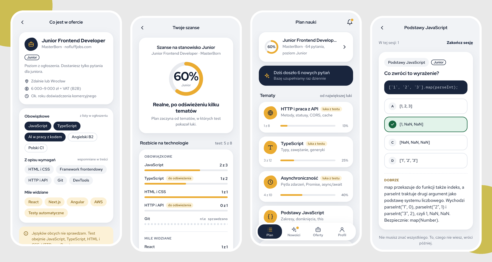

# Manabi 学び

Interview prep for developers. Paste a job offer, take a short test on the technologies it asks for, see where you stand, then practise the questions you are likely to hear.

> **Status: early work in progress.** The question bank and its tooling are here; the app itself is being built from the design below.



## How it works

1. **A short intro** — five fixed questions about your experience.
2. **Paste a job offer link** — the app reads the required technologies and the seniority level.
3. **Quick test** — a handful of questions on exactly those technologies.
4. **Your chances** — a rough score, split into must-have and nice-to-have skills.
5. **Study plan and practice** — as many questions as you want, with explanations and spaced repetition.

## Design decisions

- **No accounts.** You give a first name; profile, offers and progress stay in your browser.
- **Questions are files, not model output.** Every question lives in this repo with a source link. The language model only reads the offer and picks question IDs from the bank — it never writes questions.
- **Practice never calls a model.** Each question is either single choice or a self-graded flashcard, so answers are checked on the device and practice is free and unlimited.
- **Levels are a hard filter.** Questions are split into junior / mid / senior. An offer for a junior never surfaces senior questions; the filter runs in code before the model sees any candidates.
- **Works without the model.** If the model is unavailable, technologies are matched by alias and questions are drawn at random, weighted towards must-have skills.

## Question bank

```
questions/
  technologies.json          closed list of technologies with aliases
  <technology>/<level>.json  questions; technology and level come from the path
  index.json                 generated metadata used to pick questions
```

```bash
npm run questions:build   # validate and regenerate questions/index.json
npm run questions:check   # what CI runs on every push
```

Questions are currently written in Polish.
